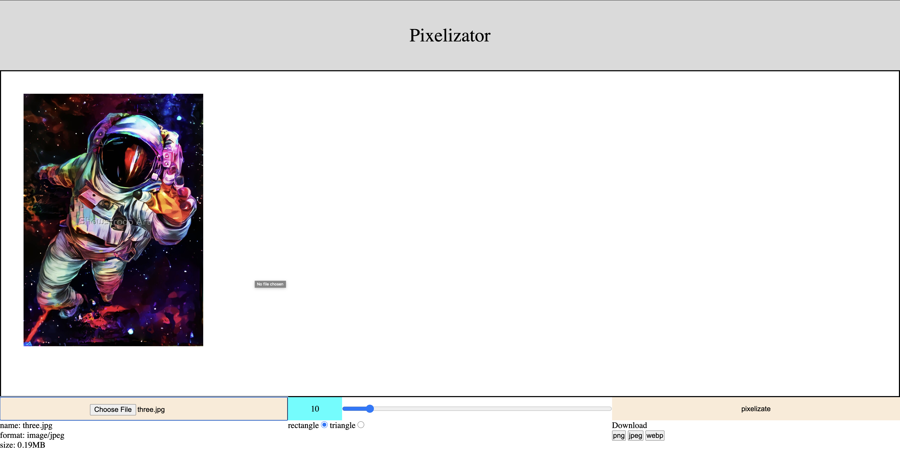

# pixelizator

Project of learning in Ucode IT Academy

### Technologies

* java 15
* maven 
* servlets
* JSP
* CSS/JS

### Install

---

You must have on your Mac

> git clone https://github.com/vstruk01/tamagotchi
>
> cd tamagotchi
>
> ./mvnw install

### Run

---

> ./mvnw tomcat7:run

### Screens

---

